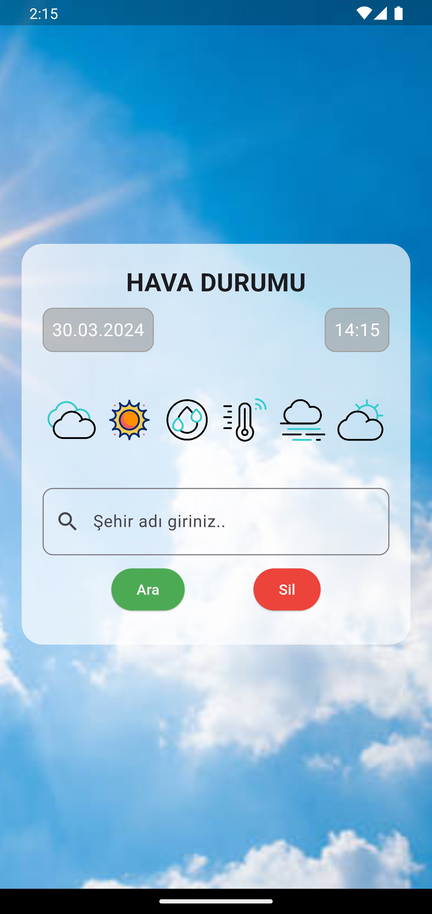
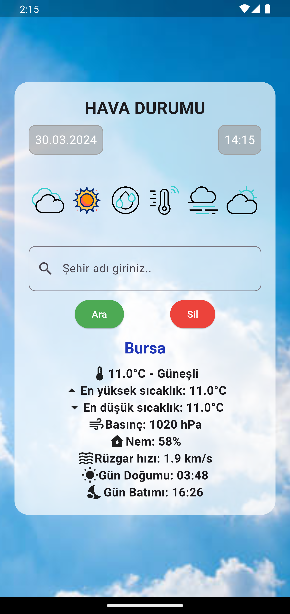
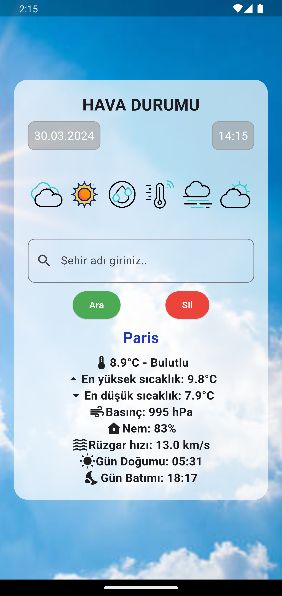
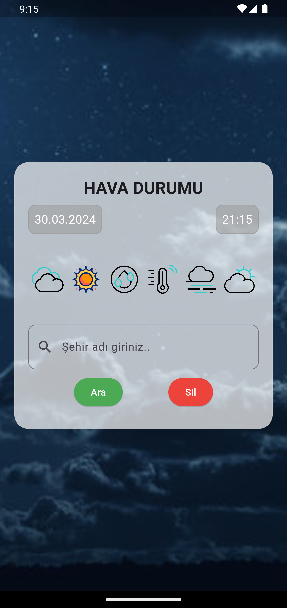
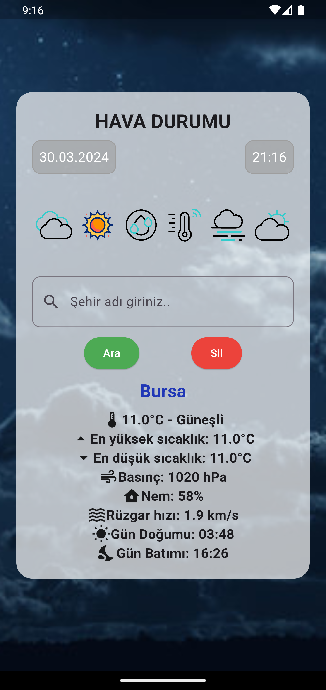
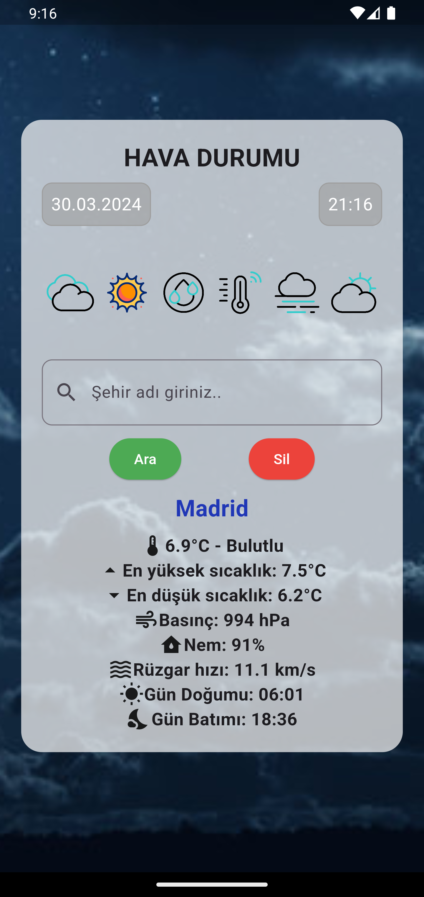

# weather_api_app (openweather)

Flutter ile geliştirilmiş provider mimarisi kullanılarak state yönetimleri sağlanan bir mobil havadurumu uygulaması.

## Kullanılan Teknolojiler

- flutter
- restfull API (openweather)
- provider
- http
- intl

 

